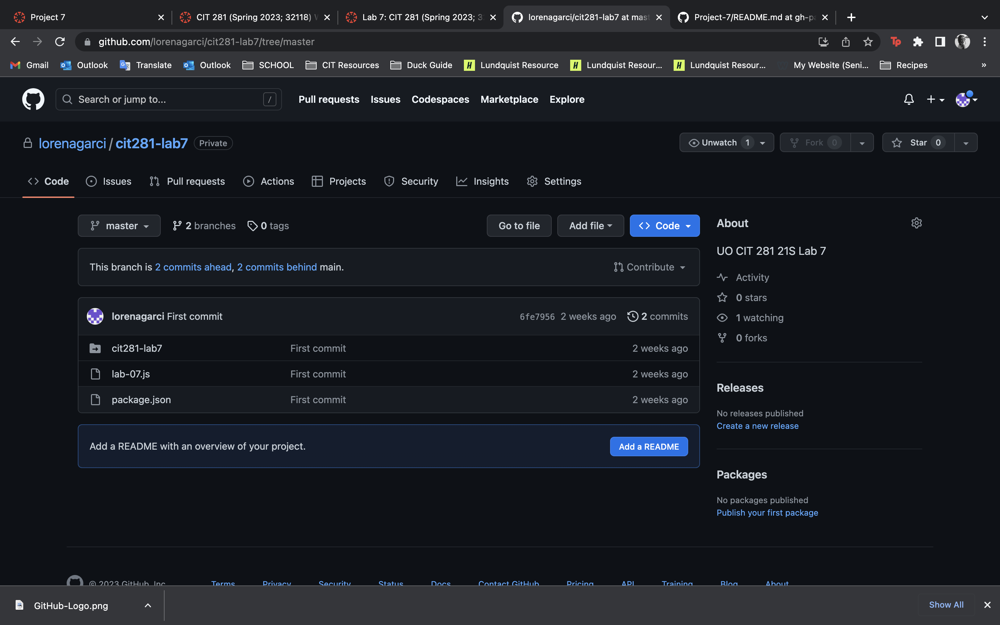

In Lab 7, I became better familiarized with key aspects of Git and GitHub, as well as the basics of setting up a Node.js project. 

I created my own GitHub organization specifically for the CIT Minor which allowed me to have a dedicated space to host my repositories and collaborate with others. After creating my first GitHub repository I learned how to create a new repository and configure its settings according to what was asked of me or the general needs of the repository itself.

I cloned my GitHub repository to my laptop and created a JavaScript file specifically for the lab. I also initialized and updated the project folder as a Node.js folder using the necessary configuration files and dependencies. In this lab I also had a hands-on experience with error handling. 

Finally, I pushed my changes back to GitHub.

I gain a solid understanding of Git and GitHub workflows, repository management, setting up a Node.js project, error handling, and version control practices. These skills are beneficial for future projects and collaborations! 

The following is an image of my repository:

